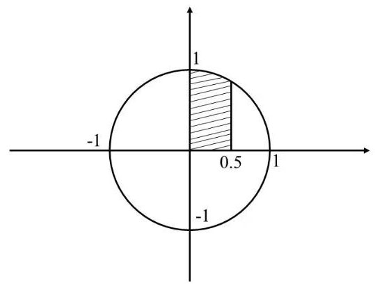
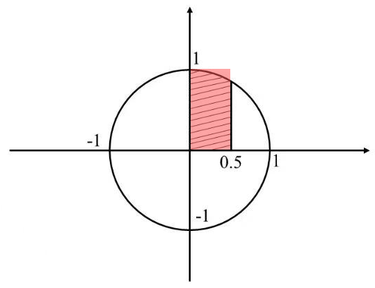
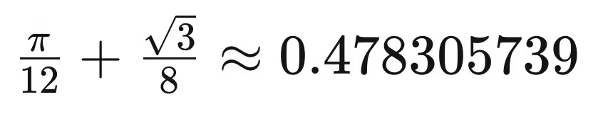

# Assignment #4

### 一、问题描述

编写程序，利用蒙特卡洛方法计算下图阴影部分面积。

### 二、算法原理

蒙特卡洛方法是一种基于随机抽样的数值计算技术，通常用于估计复杂问题的数值结果，而无需精确解析或确定性计算。在此程序中使用蒙特卡洛方法来估算以(0,0)为圆心、半径为1的圆在第一象限且x＜0.5的部分的面积。

以下是代码的算法原理：

**导入模块：**导入random 模块用于生成随机数。导入perf_counter 用于计算程序的运行时间。定义DARTS 常亮用于模拟中随机点数量。hist 变量用于计算在圆内的点的数量。start 变量记录模拟开始时的时间。

**执行模拟：**代码使用一个循环来模拟抛点的过程。每次循环中，它生成一个随机的 (x, y) 坐标点，其中 x 的范围是 [0, 0.5]， y 的范围是 [0, 1]。这个过程模拟了在一个包含目标区域的矩形内随机抛点的操作。

抛点范围如下：

**判断点是否在圆内：**通过计算点到原点 (0,0) 的距离的平方 dits（即 x ** 2 + y ** 2），代码确定每个点是否在圆内。如果 dits 小于等于1.0，那么这个点被认为在圆内，并将 hist 计数器加1，以记录符合条件的点的数量。

**计算面积：**最后计算面积 S，通过使用 (hist / DARTS) 来表示在圆内的点的比例，并乘以落点区域面积0.5。

**输出结果：**代码打印出估算的面积和程序运行的时间。

### 三、运行结果

使用数学公式法计算结果为：

使用此程序计算结果如下表所示：

| DARTS       | 面积          | 运行时间      |
| ----------- | ----------- | --------- |
| 1000        | 0.4805      | 0.00039s  |
| 1000*10     | 0.47885     | 0.00324s  |
| 1000*100    | 0.478075    | 0.03346s  |
| 1000*1000   | 0.4782855   | 0.33819s  |
| 1000*10000  | 0.47824165  | 3.29470s  |
| 1000*100000 | 0.478325715 | 33.05399s |

### 四、分析和结论

从运行结果可以看出：

**增加投掷点数量会提高准确性：** 随着投掷点的数量增加，估计的结果会更接近真实值。运行时间也将增加。这是因为更多的点将更好地覆盖了要估计的区域，从而减小了随机误差。蒙特卡洛方法的关键思想是通过大量的随机抽样来逼近准确值。

**投掷点数量与程序运行时间成正比：**当增加投掷点的数量时，程序需要生成和处理更多的随机点。
